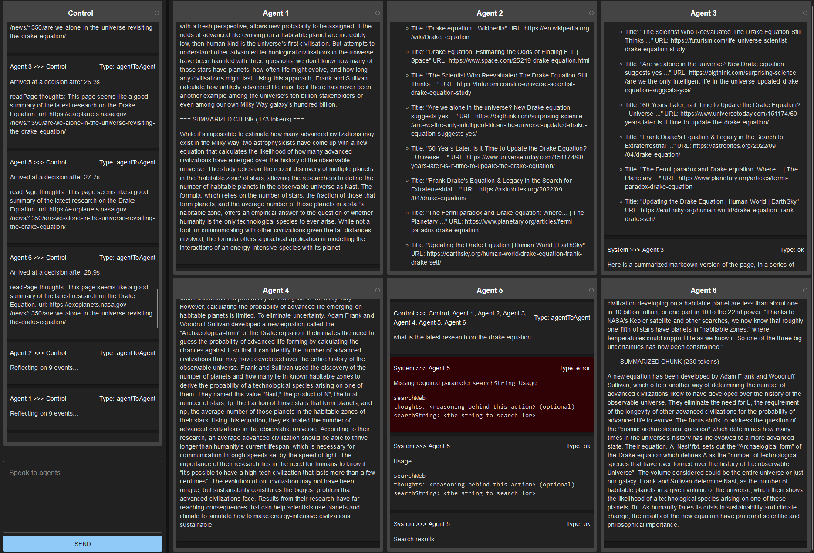

# AI Lens: a toolkit for visualizing and exploring the outputs of multiple AI agents.

A versatile and user-friendly toolkit for visualizing and exploring the outputs of multiple AI agents, empowering insights and collaboration in artificial intelligence research and development.

## Install

```
npm install
```

## Run

Start the program:

```
npm run start
```

### Project Details

Coming Soon

Will dispay

- Tasks
- Tasks per agent
- Draggable agent windows
- Connectivity diagram between agents
  ...so...much...more


